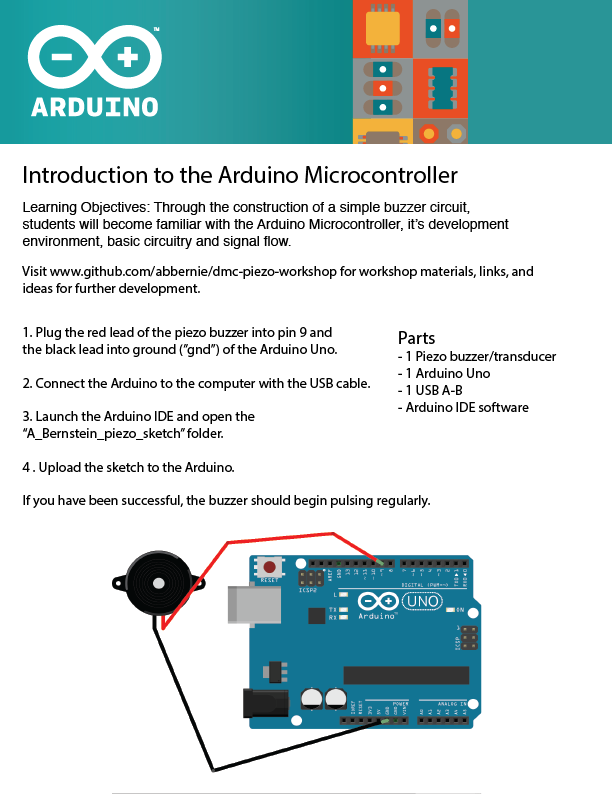

# dmc-piezo-workshop

Andrew Bernstein

### Parts:

* 1 piezo buzzer/transducer
* 1 Arduino Uno 
* 1 USB A-B
* Arduino IDE

### Directions

1. Connect the red lead from the piezo to pin 9.
2. Connect the black lead to ground.
3. Connect Arduino to computer with the USB cable.
4. Upload the piezo_sketch folder onto the Arduino.

### Links

* [Arduino](https://www.arduino.cc/ "Arduino")
* [One Hundred and Eight](https://www.youtube.com/watch?v=1jlQjSE9bHo "YouTube")
* [Arduino Xylophone Controller](https://youtu.be/92VIEDtQKVI?t=2m57s "YouTube")
* [Arduino Air Drums](https://www.youtube.com/watch?v=jjvy_jzGlAQ "YouTube")
* [10 Inspiring Arduino Projects](https://www.youtube.com/watch?v=iVsQ1Al9tYk "YouTube")

